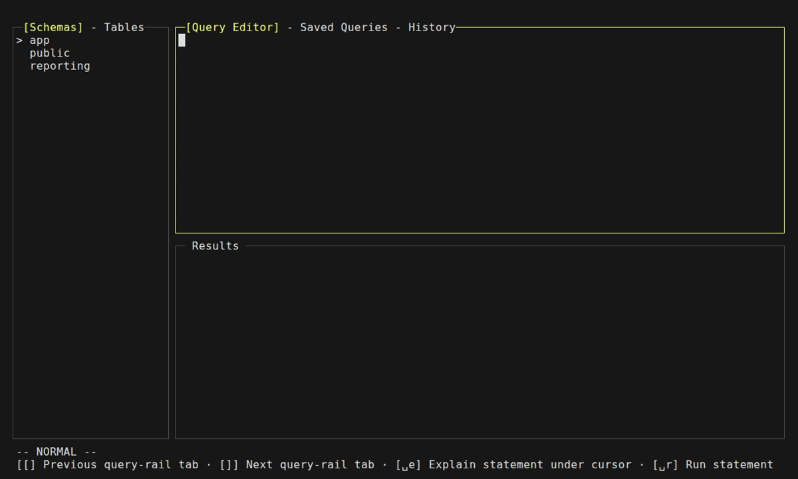
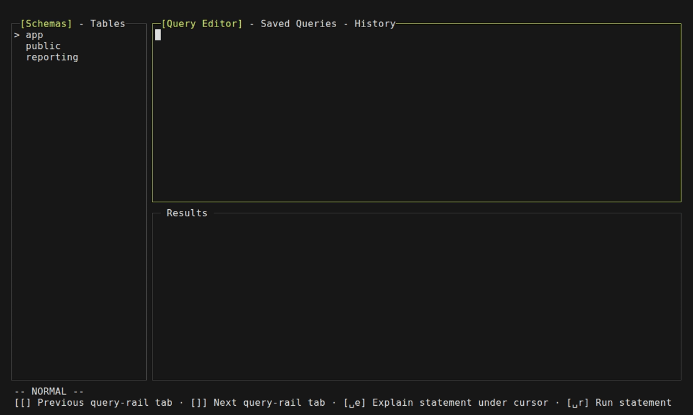
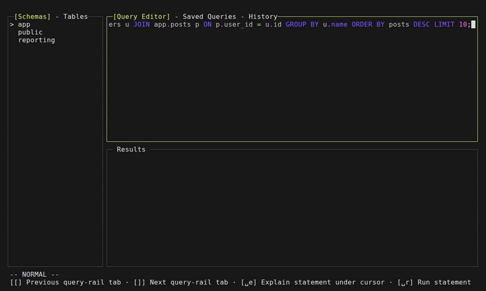
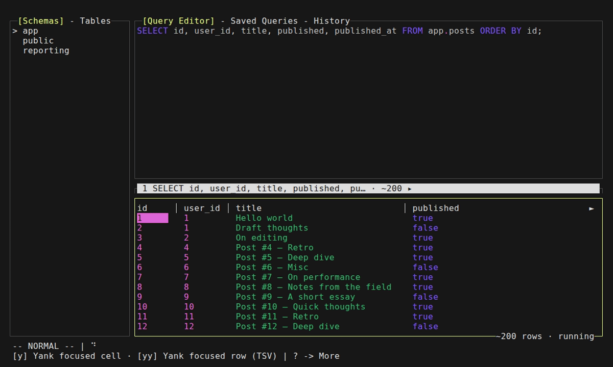
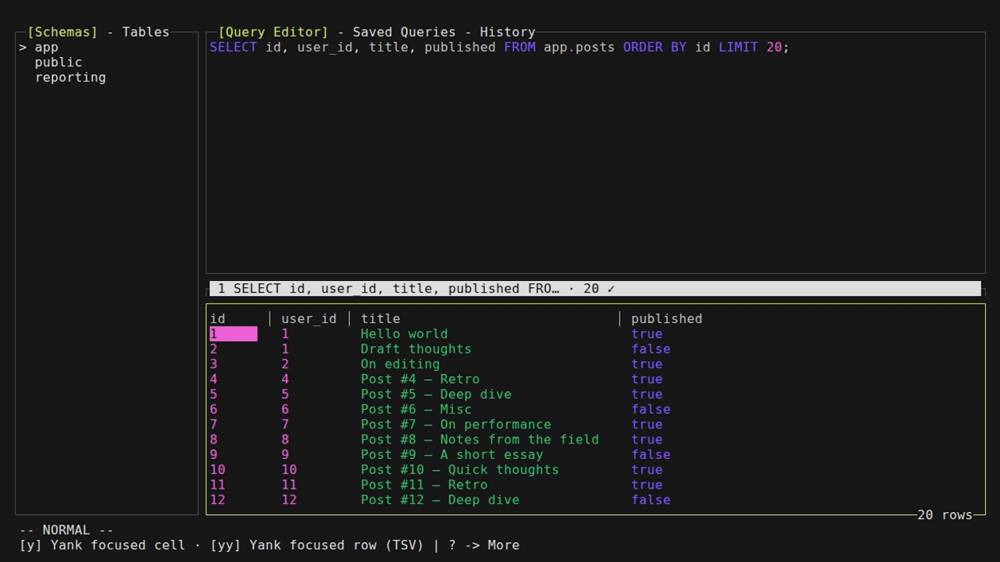
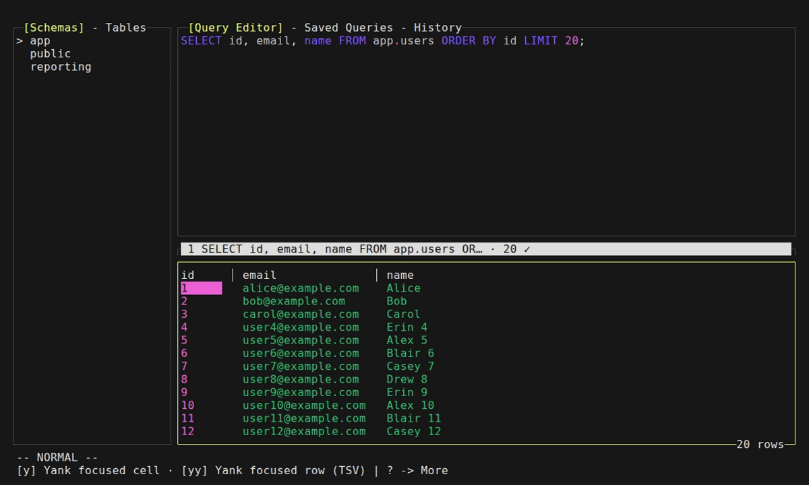
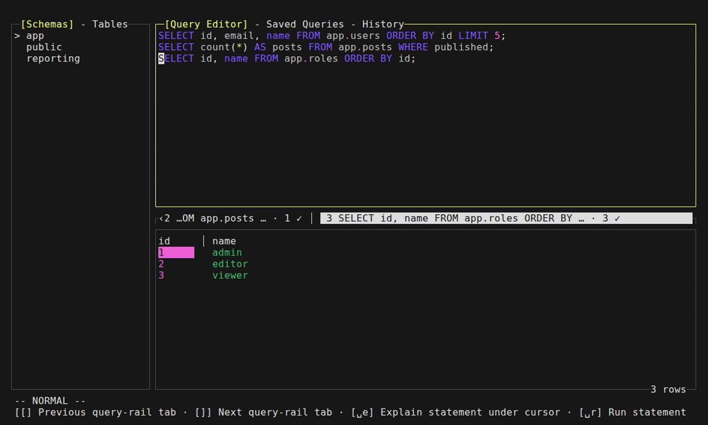
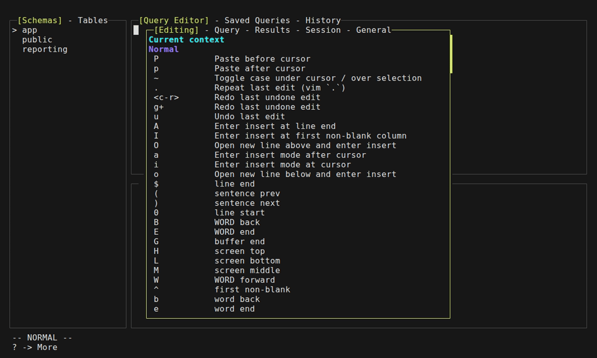

# pgsavvy

[](https://github.com/davesavic/pgsavvy/actions/workflows/ci.yml)
[](LICENSE)

A vim-style TUI PostgreSQL client built like [lazygit](https://github.com/jesseduffield/lazygit) — fast keyboard navigation, modal panes, and a focused workflow for browsing and querying your database from the terminal.


## Status

Active development

## Table of Contents

- [Features](#features)
- [Configuration](#configuration)
- [Install](#install)
- [Updating](#updating)
- [Quick Start](#quick-start)
- [Requirements](#requirements)
- [Development](#development)
- [Documentation](#documentation)
- [License](#license)

## Features

### Connection Management

Connect to PostgreSQL through connection profiles with a full modal manager. Profiles support SSH tunnels with identity-file, agent, and passphrase-prompt authentication. Credentials are resolved through a configurable waterfall — `password_command`, OS keyring (via [99designs/keyring](https://github.com/99designs/keyring)), `~/.pgpass`, or an interactive prompt. A test-connection command (`t` in the form) validates the profile before saving without disturbing the active session. Paste a connection DSN from the clipboard and reconnect from the TUI without restarting.

### Schema Browser

Navigate the left-rail consolidated schema/tables browser with vim keys (`j`/`k`/`gg`/`G`) and horizontal panning for wide names. Per-rail search (`/`, `n`/`N`, `<esc>`) highlights and jumps to matches across schemas and tables. Hide schemas you rarely work with (`H`), unhide to browse them again (`U`), or toggle hidden-schema visibility (`<leader>H`). Open a tabbed table-inspect modal (`i`) showing columns, constraints, foreign keys, and indexes with scroll and tab-cycle support.

  

### SQL Editor

A full vim modal editor for SQL — Normal, Insert, Visual (char/line/block), and Operator-Pending modes. Motions cover word/WORD, line, paragraph, sentence, and screen navigation via the h/j/k/l home row. Operators — delete, yank, change, case-switch, indent — combine with motions and text objects through the standard op-pending workflow, and `.` repeat replays the last operator from the current cursor position. Text objects include `is`/`as` for SQL statements (delimited by chroma-aware token parsing, not semicolons alone) plus `iw`/`aw`, `i{`/`a{`, `i"`/`a"`, and paragraph objects. Named registers (`"a`–`"z`) and clipboard registers (`""`, `"+`, `"*`) are fully supported. Undo branches through history with redo via `<c-r>`. Syntax highlighting is powered by [Chroma](https://github.com/alecthomas/chroma) with a PostgreSQL lexer producing ANSI truecolor SGR output, and the editor formats SQL via [sqlfmt](https://github.com/wasilibs/sqlfmt) on `<leader>F`.

  

### SQL Completions

Omni-completion (`<c-x><c-o>`) populates a candidate popup from three sources: schema objects (tables, columns, functions), SQL functions, and query history. Auto-trigger mode fires the popup after recognised SQL contexts (`FROM `, `JOIN `, `<word>.`) without requiring a manual chord — configurable via `editor.autocomplete` in `config.yml`. When auto-complete-alias is enabled, accepting a table candidate after `FROM` inserts an editable deduplicated alias (e.g. `users u`) automatically. Multi-source completion candidates include SQL snippets that expand as a single undo node.

### Query Execution & Transaction Control

Run the statement at cursor (`<leader>r`), all statements (`<leader>R`), or EXPLAIN / EXPLAIN ANALYZE (`<leader>e` / `<leader>E`) — each dispatches through a shared classification gate. Write and DDL statements are gated behind a confirmation popup that flags writable CTEs (CTEs containing DML) alongside the usual INSERT/UPDATE/DELETE and DDL detection. Per-statement timeouts apply a configurable ceiling via `SET statement_timeout` with injection-resistant canonicalisation. Long-running queries can be cancelled via `<leader>x`, which sends a PostgreSQL CancelRequest on a separate out-of-band connection. Run single statements in a fresh transaction with `<leader>!`.

Transaction control includes BEGIN (`<leader>tb`), COMMIT (`<leader>tc`), ROLLBACK (`<leader>tr`), savepoints (`<leader>ts`), release savepoint (`<leader>tR`), and rollback to savepoint (`<leader>to`) — all with inline toast feedback and the options-bar reflecting the current transaction status.

<!-- GIF_PLACEHOLDER: feat-tx.gif — transaction begin, commit, and rollback -->

### EXPLAIN Plans

EXPLAIN / EXPLAIN ANALYZE output renders as an interactive tree in a plan-dedicated result tab. Collapse or expand individual nodes with `<cr>`, expand all (`<c-a>`), collapse all (`<c-x>`), or jump to the heaviest subtree (`H`). Toggle between raw plan text and the interactive tree view (`o`). Plan-doctor insights (`i`) surface ranked findings — sequential scans, high cost nodes, missing indexes — drawn from a rule engine that inspects the plan JSON.

  

### Result Grids

Query results open in numbered tabs (1–9, jumped to via `<leader>1`–`<leader>9`) with pin, close, and cycle controls. Rows stream incrementally with pagination (`]p`/`[p`, configurable page size) and a read-to-end drain that warns before fetching very large row sets. Search within the grid (`/`) highlights matches; navigate with `n`/`N`. Sort by column (`<leader>s`) cycles ascending → descending → clear. Select cells (`v`), entire rows (`V`), or rectangular blocks (`<c-v>`) for visual range highlighting. Yank a cell (`y`) or the full row as TSV (`yy`) to the system clipboard. Toggle between the grid view and an expanded record view with `<leader>gx` — persisted globally across sessions.

<!-- GIF_PLACEHOLDER: feat-hide-columns.gif — column visibility overlay -->

  

### Relationship Explorer

Open the right-docked foreign-key panel with `<leader>gr` to see every parent and child relationship for the row under the cursor. Navigate outbound (parent) FKs forward into referenced rows with `gd`, which opens a parameterised SELECT in a new result tab. Navigate inbound (child) relationships with `gD` through a tabbed picker showing every table that references the current row's column, with composite-FK support. Jump back through the per-tab navigation history with `<c-o>` and forward with `<c-i>`. The panel tracks cursor movement within the grid so relationship lines update as you scroll, acting as a live breadcrumb.

<!-- GIF_PLACEHOLDER: feat-fk-reverse.gif — reverse foreign key picker -->

  

### Inline Cell Editing

Enter cell-edit mode (`i` on a focused cell) to edit the value directly or via SQL expression. Type-aware validation runs on commit — integers, timestamps, JSON, and booleans are parsed and validated before staging. Per-type helpers insert expression templates: `<c-n>` sets NULL, `<c-t>` generates `now()`, `<c-d>` inserts `current_date`, and `<c-e>` opens the SQL expression prompt. Staged edits accumulate per table until the commit dialog is opened (`:w` or `<leader>cw`), where you can review each change, dry-run the statements (`[d]`), toggle the generated SQL preview (`[s]`), and apply with an optional typed-name confirmation gate. On conflict — the row changed between your read and commit — the conflict dialog presents the current DB values side-by-side with your edit for refresh or overwrite. Discard all pending edits for a table with `<leader>cU`, or the edit under cursor with `<leader>cu`.

<!-- GIF_PLACEHOLDER: feat-commit.gif — commit dialog with staged edits -->

  

### Export

Export active result-tab contents through the export menu (`<leader>oe`) with format and destination cycling. Supported formats: CSV, TSV, JSON array, NDJSON (newline-delimited JSON), Markdown table, and SQL INSERT statements. Destinations: write to a file with atomic partial-then-rename under mode 0600, copy to the system clipboard with a byte cap, or print to stdout. The export menu supports an editable file path during export.

<!-- GIF_PLACEHOLDER: feat-export.gif — result export menu with format and destination -->

### Cell Viewer

Open the full cell-content viewer popup (`<leader>gv`) for any focused cell in a result grid. Scroll the viewer with full vim scroll, page, and jump bindings within the popup. Toggle line wrapping (`w`) and pretty-print JSON cells (`p`) directly inside the viewer. Yank the cell value to the system clipboard (`y`) or bridge directly into the cell editor from the viewer (`e`).

<!-- GIF_PLACEHOLDER: feat-cell-viewer.gif — full cell content viewer popup -->

### Query History & Saved Queries

Query history persists in a local SQLite database (`$XDG_STATE_HOME/history.sqlite`) with FTS5 full-text search backing the recall popup. Open the history tab (`<leader>h`) to browse, search, and insert past queries into the editor — with content-deduplication so repeated identical queries compress to a single record.

Save queries for later use: capture the statement under cursor or a visual selection with `<leader>s`, give it a name, and it persists to `queries.yml` in the config directory. Open the saved queries tab (`<leader>o`) to browse, insert, and delete saved queries with standard vim navigation. Both history and saved queries share the query-rail container tab bar, cycled with `]` and `[` inside the query pane.

<!-- GIF_PLACEHOLDER: feat-saved-queries.gif — saved queries browser and management -->

  

### Session Settings

Change PostgreSQL session variables on the fly: SET search_path via `<leader>p` with a pre-filled prompt, and SET statement_timeout via `<leader>tt` with duration validation and injection-resistant canonicalisation. The Ex-command line (`:`) dispatches registered commands including `:reload`, which hot-reloads the user config (keybindings, theme, UI settings) without restarting — file-backed sources are serialised so multiple invocations coalesce safely. `:set` and `:reset` give programmatic control over session variables from the command line. The connection status line shows the active profile, database, and transaction/error state.

<!-- GIF_PLACEHOLDER: feat-session-settings.gif — session settings, set, and reload -->

### Discoverability

Press `?` anywhere to open the auto-generated, tabbed keybinding cheatsheet — it renders every keybinding registered for the current context, organised by functional category (Editing, Query, Results, Cells, Session, General). Which-key automatically pops up when you pause mid-chord — after pressing `<leader>` (by default `\` or `<space>`), a 300ms idle period shows all available `<leader>`-prefixed bindings for the current context. The always-visible options bar at the bottom of the screen shows the most important keybindings for the active pane, with a "more" hint when additional chords are registered.

  

### Additional Features

- **Theming** — Configurable colours via named ANSI codes or hex (`#rrggbb`) with truecolor (24-bit) output.
- **Internationalisation** — Locale-aware translations with English fallback. Locale is detected from the environment at startup; translations are embedded JSON resources loaded via the `i18n` package.
- **Session logs** — Per-session structured JSON debug logs with automatic secret redaction. Tagged log fields (`log:"redact"`) are scrubbed, DSN connection strings are regex-redacted, and logs rotate with retention limits.
- **Self-update** — Release binaries update themselves in place with `pgsavvy update`, verifying the SHA-256 checksum from the GitHub Release. Non-release builds (go install, source) refuse to self-update safely.
- **Mouse support** — Optional mouse interaction toggleable via `ui.mouse.enabled` in the user config. Mouse mode registers click bindings on interactive views so you can select cells, scroll results, and activate popups without the keyboard.
- **Customisable keybindings** — Every action in the TUI is bound through an action ID registry. Users can remap any chord or add new chords in `config.yml` under the `keybindings` key, with `:reload` picking up changes without restarting.

## Configuration

pgsavvy follows the XDG Base Directory spec. Config files live under `$XDG_CONFIG_HOME/pgsavvy` (defaults to `~/.config/pgsavvy`); runtime state lives under `$XDG_STATE_HOME/pgsavvy` (defaults to `~/.local/state/pgsavvy`). All files are YAML.

| File | Location | Purpose |
|------|----------|---------|
| `config.yml` | `~/.config/pgsavvy/` | Keybindings, theme, UI/query settings |
| `connections.yml` | `~/.config/pgsavvy/` | Connection profiles |
| `queries.yml` | `~/.config/pgsavvy/` | Saved queries |
| `state.yml` | `~/.local/state/pgsavvy/` | App state — auto-managed, do not edit by hand |
| Session logs | `~/.local/state/pgsavvy/sessions/` | Per-session JSON debug logs (redacted) |

### Environment variables

Key environment variables for controlling runtime behaviour:

| Variable | Effect |
|----------|--------|
| `PGSAVVY_LOG_DIR` | Override the session-log directory |
| `PGSAVVY_DISABLE_SESSION_LOG=1` | Disable file logging (stderr only) |
| `PGSAVVY_LOG_INCLUDE_SQL=full` | Include **full** SQL text — see warning below |
| `PGSAVVY_LOG_INCLUDE_PARAMS=1` | Include bound parameter values (forensic opt-in) |
| `PGSAVVY_KEYRING_PASSPHRASE` | Passphrase for the file-backed OS keyring |
| `NO_COLOR` | Disable coloured output |
| `XDG_CONFIG_HOME` | Override config/storage location (relocates `~/.config`) |
| `XDG_STATE_HOME` | Override state/log location (relocates `~/.local/state`) |
| `XDG_CACHE_HOME` | Override cache location |
| `XDG_DOWNLOAD_DIR` | Override self-update download directory |

> **WARNING: PGSAVVY_LOG_INCLUDE_SQL=full** logs SQL statements verbatim with **no password scrubbing** and **no truncation**. Passwords appearing in SQL text (e.g. `ALTER USER ... PASSWORD '...'`) will be written to disk unredacted. This is a forensic-only option for debugging — do **not** enable it routinely or in production. Session logs persist at `~/.local/state/pgsavvy/sessions/` unless manually deleted.

> **WARNING: PGSAVVY_KEYRING_PASSPHRASE** is read from the process environment. Avoid setting it in shell profiles (`.bashrc`, `.zshrc`) where other processes can read it. Prefer a dedicated secrets manager or ephemeral export.

> **Note: PGSAVVY_LOG_INCLUDE_PARAMS=1** exposes bound query parameter values in plain text. Use only for forensic debugging in isolated environments.

> See **[docs/INSTALL.md](docs/INSTALL.md#configuration-files)** for the complete configuration reference covering all ~90 config items.

## Install

### Release binaries (recommended)

Prebuilt binaries are published on the [Releases](https://github.com/davesavic/pgsavvy/releases) page. Each asset is the raw `pgsavvy` binary for one OS/arch (named `pgsavvy_<tag>_<os>_<arch>`, `.exe` on Windows) alongside a `checksums.txt`. Download the binary for your platform, make it executable, and put it on your `PATH`:

```sh
# example for linux/amd64; adjust the asset name for your platform
curl -fsSLo pgsavvy https://github.com/davesavic/pgsavvy/releases/latest/download/pgsavvy_<tag>_linux_amd64
chmod +x pgsavvy
mv pgsavvy ~/.local/bin/   # or anywhere on your PATH
```

**A release binary is the recommended install because it can update itself in place** with `pgsavvy update` (see [Updating](#updating) below). `go install` and source builds carry no release metadata and cannot self-update.

### go install

```sh
go install github.com/davesavic/pgsavvy@latest
```

> **Note:** `go install` builds carry no embedded version metadata, so `pgsavvy --version` reports a placeholder and `pgsavvy update` refuses to self-update. Install a release binary if you want in-place updates.

### Build from source

```sh
git clone https://github.com/davesavic/pgsavvy.git
cd pgsavvy
task build       # produces bin/pgsavvy with -ldflags-injected version metadata
```

See the [install & usage guide](docs/INSTALL.md) for full details.

## Updating

A release binary updates itself in place:

```sh
pgsavvy update
```

This downloads the matching asset from the latest GitHub Release, verifies its SHA256 against `checksums.txt`, and atomically replaces the running executable. Re-run `pgsavvy` afterwards to use the new version.

- Already on the latest release? It prints an up-to-date message and exits.
- Builds without release metadata (`go install`, dev/source builds) refuse to self-update — install a release binary instead.
- Package-manager / read-only installs (Homebrew, Nix) refuse and defer to that manager.

See [docs/INSTALL.md](docs/INSTALL.md#updating-pgsavvy-update) for the full update reference.

## Quick Start

```sh
pgsavvy          # starts the TUI and opens the connection manager
```

On first run, create a connection profile in the connection manager (or edit `~/.config/pgsavvy/connections.yml` directly), then connect. Press `?` for the keybinding cheatsheet; see [docs/keybindings.md](docs/keybindings.md) for the full reference.

## Development Requirements

- [Go 1.26](https://go.dev/dl/)
- [go-task](https://taskfile.dev) v3 — `go install github.com/go-task/task/v3/cmd/task@latest`
- [golangci-lint](https://golangci-lint.run) v2 — `go install github.com/golangci/golangci-lint/v2/cmd/golangci-lint@v2.12.2`
- [Docker Compose](https://docs.docker.com/compose/) — optional, only needed for the Postgres / SSH-tunnel integration fixtures

## Development Commands

```sh
task --list            # all available tasks
task build             # compile to bin/pgsavvy
task test              # unit tests (forwards args: task test -- -run TestX)
task lint              # golangci-lint v2
task fmt               # gofumpt + goimports via golangci-lint formatters
task vulncheck         # pinned govulncheck

task pg:up             # bring up the Postgres integration fixture
task test:integration  # integration tests (requires PGSAVVY_TEST_PG + fixture)
task test:all          # unit + integration
task pg:down           # tear down the fixture (removes container + volume)

task sshtunnel:up      # SSH bastion + private Postgres fixture (tunnel tests)
task sshtunnel:down
```

Integration tests are gated by `PGSAVVY_TEST_PG`; `internal/pgprobe` fail-loud checks reachability before the suite runs so it can't silently skip. See [CONTRIBUTING.md](CONTRIBUTING.md) for the full contributor workflow.

### Integration fixture gotcha

Bringing the Postgres fixture up against a pre-existing `pgdata` volume skips the env-driven init step — the official `postgres` image only honors `POSTGRES_USER` / `POSTGRES_DB` on an empty data directory. Before running integration tests against a fresh schema, tear the stack down with the volume:

```sh
task pg:down && task pg:up
```

## Documentation

- [docs/INSTALL.md](docs/INSTALL.md) — install & usage guide
- [docs/keybindings.md](docs/keybindings.md) — full keybinding reference
- [CONTRIBUTING.md](CONTRIBUTING.md) — development workflow for contributors
- [SECURITY.md](SECURITY.md) — vulnerability disclosure

## License

[Apache 2.0](LICENSE) — Copyright (c) 2026 Dave Savic.
